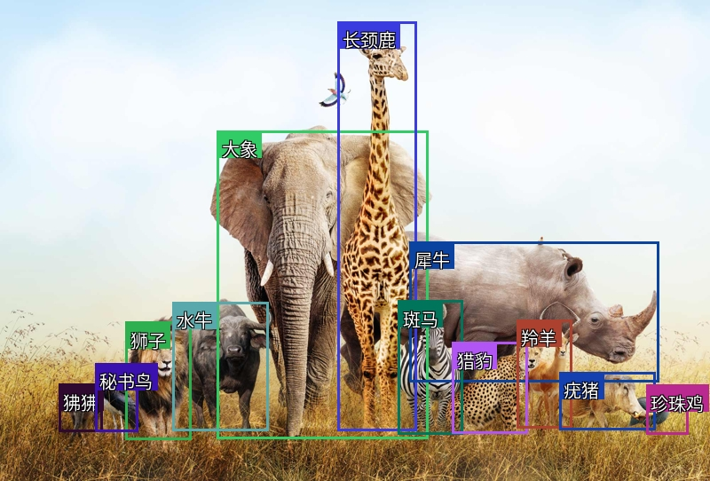

# Bounding with Gemini

This Streamlit application allows you to upload an image, send it to the Gemini API for bounding box detection, and visualize the results with labeled bounding boxes drawn directly on the image.
Automatically generated ReadME. This should be very straight forward.

Example Screen cap:



## Features

- Upload images in JPG, JPEG, or PNG format.
- Send a prompt to the Gemini API to detect objects and return bounding box coordinates.
- Visualize detected bounding boxes on the image with customizable labels.
- Download the processed image with bounding boxes.

## Prerequisites

Before running the application, ensure you have the following installed:

- Python 3.9 or later
- A valid Gemini API key

### Install Required Python Packages

Install the necessary Python packages using `pip`:

```bash
pip install streamlit Pillow google-generativeai
```

## Running the Application

1. **Clone the Repository:**

   ```bash
   git clone https://github.com/AlexZhangji/bonding_w_geimini.git
   cd bonding_w_geimini
   ```
2. **Run the Streamlit App:**
   Start the application with the following command:

   ```bash
   streamlit run bbox.py
   ```
3. **Enter Your Gemini API Key:**

   - On the sidebar, enter your Gemini API key in the input box. This key is required to interact with the Gemini API.
4. **Upload an Image:**

   - Click "Browse files" to upload a JPG, JPEG, or PNG image from your local machine.
5. **Enter a Prompt:**

   - Enter a prompt in the text area that describes how you want the Gemini API to detect objects and return bounding boxes.
6. **Process the Image:**

   - Click the "Process" button to send the image and prompt to the Gemini API.
   - Wait for the results, which will display the image with bounding boxes drawn around detected objects.
7. **Download the Processed Image:**

   - After processing, you can download the image with the bounding boxes drawn by clicking the "Download Image with Bounding Boxes" button.
